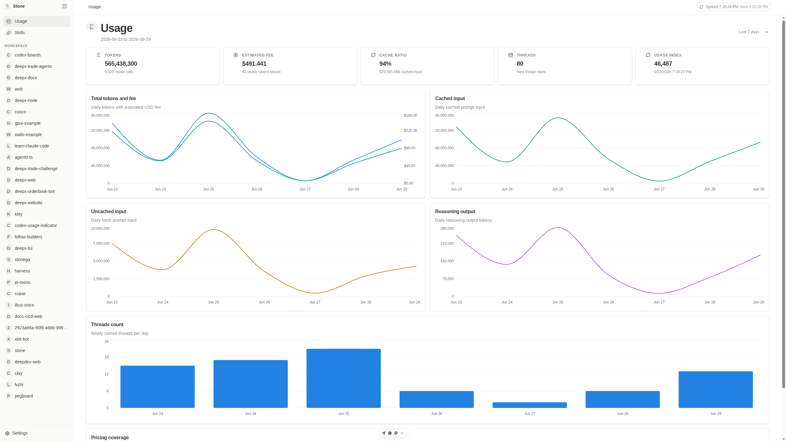

# codex-boards

`codex-boards` is a local-first Bun monorepo that turns local Codex rollout history into a project-oriented issue board.

It scans Codex session rollouts, keeps Git-backed threads, extracts parent issues and sub-issues, stores the results in SQLite, and renders them in a React/Vite workspace with project navigation, filters, saved views, detail sheets, parser settings, live sync status, first-run onboarding, and local skill catalogs.



## Getting Started

Install dependencies:

```bash
bun install
```

Recommended local browser workflow:

```bash
bun run codex-board
```

The `codex-board` CLI starts the backend API and Vite web app locally, waits for both ports to become reachable, and opens the web UI. On first open, the UI asks for an OpenAI-compatible parser provider, runs the first sync, and then enters the board. After that, the backend schedules background sync once per minute for newly added or file-updated threads, and the homepage shows live status.

Separate local servers:

```bash
bun run dev:backend
bun run dev:web
```

Default local URLs:

- Web: `http://localhost:5673`
- Backend: `http://localhost:7788`

## Current Packages

- `apps/backend`: Hono API, rollout sync service, SQLite persistence, OpenAI-compatible parsing, fallback issue extraction, skill discovery, skill recommendations, and Multica export.
- `apps/web`: React 19 + Vite app with the board UI, issue detail sheets, runtime parser settings, sync history, global skills, project skills, and recommended skill cards.
- `packages/domain`: Shared TypeScript contracts and deterministic helpers for projects, issues, sync diagnostics, parser settings, skills, and exports.

The root workspace is managed with Bun workspaces:

```text
apps/
  backend/
  web/
packages/
  domain/
docs/
  design/
  implementation/
  user/
examples/
scripts/
tests/
```

## What It Does

The sync pipeline:

1. Reads rollout `.jsonl` files from `~/.codex/sessions` by default.
2. Keeps only threads with Git workspace evidence.
3. Infers projects from repository names and workspace paths.
4. Builds a truncated parse payload for each thread.
5. Extracts a parent issue and optional sub-issues through an OpenAI-compatible parser when configured.
6. Falls back to deterministic issue shaping when AI parsing is unavailable or fails.
7. Skips unchanged rollout files on later manual syncs unless the file or parser fingerprint changed; automatic background sync only queues newly added or file-updated threads.
8. Stores projects, issues, Git evidence, parser diagnostics, sync runs, saved views, and settings in SQLite.
9. Exposes the data through a local HTTP/WebSocket API consumed by the web UI.

The web UI supports:

- project sidebar navigation
- issue table with search, status, priority, parse mode, review, commit, tag, and saved-view filters
- issue detail sheets with traceability, Git evidence, warnings, parse previews, sub-issues, review toggling, merge, and split actions
- parser settings with persisted OpenAI-compatible base URL, model, and API key status
- first-run provider setup, an onboarding sync screen, homepage sync status, and sync history with per-file parse logs
- global skills catalog discovered from local Codex, agent, and enabled plugin skill roots
- project skills catalog discovered from `.codex/skills` and `.agents/skills` inside each project workspace
- project skill recommendations ranked from issue and thread evidence
- Multica export from the UI or backend CLI

## Usage Guide

Install the CLI from npm:

```bash
npm install -g codex-board
```

The published CLI requires `bun` to be available on your `PATH`.

Start Codex Boards with the default local ports:

```bash
codex-board
```

By default, this starts:

- Web UI: `http://localhost:5673`
- Backend API: `http://localhost:7788`

Start without opening a browser:

```bash
codex-board --no-open
```

Use different ports when the defaults are already in use:

```bash
codex-board --web-port 5680 --backend-port 7789
```

Bind to a different host:

```bash
codex-board --host 0.0.0.0
```

Clear Codex Boards local SQLite data before startup:

```bash
codex-board --clear
```

Show CLI help or the installed version:

```bash
codex-board --help
codex-board --version
```

Common environment overrides:

```bash
CODEX_SESSIONS_ROOT=/path/to/codex/sessions codex-board
CODEX_BOARDS_DB_PATH=/path/to/codex-boards.sqlite codex-board
CODEX_BOARDS_SYNC_INTERVAL_MS=0 codex-board
```

## Export CLI

Export issues to Multica:

```bash
bun run --filter @codex-boards/backend start -- issues export multica --project codex-boards
```

Useful export flags:

- `--issue <issue-id>`: export only selected parent issues
- `--no-children`: skip sub-issues
- `--dry-run`: print generated `multica issue create` commands without executing them
- `--skip-sync`: export the current SQLite state without running a sync first

## Configuration

Runtime paths:

- `CODEX_SESSIONS_ROOT`: rollout root, defaults to `~/.codex/sessions`
- `CODEX_BOARDS_DB_PATH`: SQLite database path, defaults to `.tmp/codex-boards.sqlite`
- `CODEX_BOARDS_APP_DATA_DIR`: app data directory; when set, SQLite is stored as `codex-boards.sqlite` under that directory
- `CODEX_HOME`: Codex home for skill discovery, defaults to `~/.codex`
- `AGENTS_HOME`: agents home for skill discovery, defaults to `~/.agents`
- `CODEX_BOARDS_SYNC_INTERVAL_MS`: background sync interval, defaults to `60000`; set `0` to disable

Optional parser configuration:

```bash
CODEX_BOARDS_PARSER_PROVIDER=
CODEX_BOARDS_CODEX_CLI_BIN=
OPENAI_COMPAT_BASE_URL=
OPENAI_COMPAT_API_KEY=
OPENAI_COMPAT_MODEL=
```

The same parser settings can be inspected and updated from the web app's Settings dialog. Settings and sync diagnostics persist in SQLite across backend restarts.

The Settings dialog includes Codex CLI, Gemini, OpenRouter, DeepSeek, and custom provider presets. The Codex CLI preset runs `codex exec` with `gpt-5.4-mini` and parses the plain final message because the CLI provider path does not rely on response schemas. Codex CLI sync runs are invoked with ephemeral execution and an internal skip marker so parser runs do not get re-imported as new Codex threads.

## API Surface

Primary backend endpoints:

- `GET /api/health`
- `GET /api/projects`
- `GET /api/issues?projectId=...`
- `GET /api/issues/:id`
- `POST /api/issues/:id/review`
- `POST /api/issues/:id/merge`
- `POST /api/issues/:id/split`
- `GET /api/settings`
- `POST /api/settings`
- `POST /api/sync`
- `GET /api/sync/status`
- `GET /api/sync/runs`
- `GET /api/views`
- `POST /api/views`
- `GET /api/skills`
- `GET /api/skills?projectId=...`
- `GET /api/skills/recommendations?projectId=...`
- `GET /api/skills/:id`
- `POST /api/export/multica`

## Skills

Global skill discovery reads:

- `${CODEX_HOME:-~/.codex}/skills`
- `${AGENTS_HOME:-~/.agents}/skills`
- enabled plugin skill roots from `${CODEX_HOME:-~/.codex}/config.toml`

Project skill discovery reads:

- `<project workspace>/.codex/skills`
- `<project workspace>/.agents/skills`

The Skills page shows the global catalog as cards. Each project page also has an `Issues | Skills` tab bar; the Skills tab shows recommended skills and the local project catalog as card grids. Selecting a card opens a slide-over panel with the full `SKILL.md` content.

## Quality Commands

```bash
bun run check
bun run build
bun test tests/backend/skills.test.ts
```

The full test suite is:

```bash
bun test
```

Current checkout note: `tests/gnome/app.test.ts` expects files under `apps/gnome`, but this checkout currently contains only `apps/backend` and `apps/web`. Until the GNOME app files are restored or those tests are updated, the full `bun test` run fails on those missing-file checks.

## Examples

The `examples/` directory contains small payloads for sync, issue extraction, and skills responses:

- `examples/sample-history.json`
- `examples/sample-thread-payload.json`
- `examples/sample-parsed-issues.json`
- `examples/sample-sync-history.json`
- `examples/sample-skills-response.json`

## Design Notes

The implementation intentionally keeps parsing inspectable:

- Git evidence extraction is deterministic.
- AI parsing is optional and OpenAI-compatible.
- Fallback mode still imports useful issues when AI parsing is unavailable.
- Low-confidence issues are marked for review instead of hidden.
- Sync history records parser target, resolved response model, request counts, token totals, and parse logs.

See also:

- `docs/design/architecture.md`
- `docs/implementation/setup.md`
- `docs/user/overview.md`
